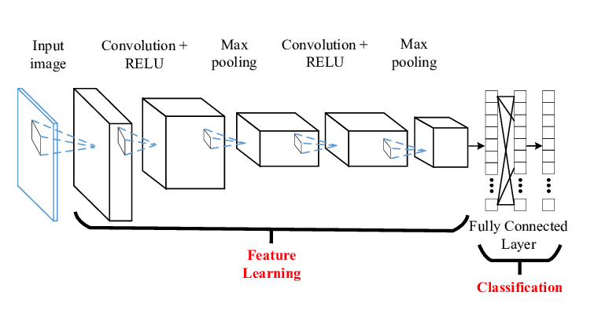
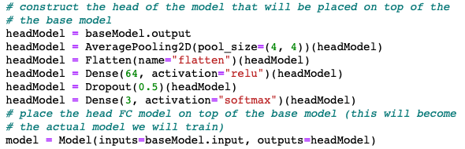

# Deep Transfer Learning with fine-tuning using Keras on Covid-19 Chest X-Rays

Can we use Deep Learning to analyze a set of chest  X-Rays of known COVID-19 patients to detect when a patient has COVID-19.

-----

The work and information in this notebook is inspired by a [blog post](https://www.pyimagesearch.com/2020/03/16/detecting-covid-19-in-x-ray-images-with-keras-tensorflow-and-deep-learning/) by Adrian Rosebrock on his website [PyImageSearch](www.pyimagesearch.com)

In that blog post, Adrian shows how to apply transfer learning using the [VGG16 Convolution Neural Network](https://neurohive.io/en/popular-networks/vgg16/) using the network weights from the ImageNet dataset.  

My additions to blog post are:

> * Added VGG19 to see how that model performs
> * Change the classifier to a 3 category classifier: covid, normal and pneumonia using the Kaggle Chest X-Ray dataset.
> * Performed validation on a test hold out set 

Lastly we will look at how a model trained on the COVID-19 XRay images does against images of normal chest XRays and chest XRays of those with Pneumonia to see if the model can accurately detect that chest XRay is NOT COVID-19.

<span style="color: red">Like Adrian, I want to be very clear that the information here, and derived from [Adrian's](https://www.pyimagesearch.com/2020/03/16/detecting-covid-19-in-x-ray-images-with-keras-tensorflow-and-deep-learning/) blog post is meant for Deep Learning educational purposes only.  In no way is it implied that this technique should be used for the identification of COVID-19.</span>

## Datasets

Two datasets will be used for this analysis.  One one source collection of chest X-Rays of COVID-19 patients hosted on Github.  There other is from the Kaggle site which contains chest X-Rays of normal lung and those with pneumonia.


### COVID-19 Chest XRay Dataset

There is github repo collecting chest X-Ray images of COVID-19 patients.  That repo can be found at the link below.

https://github.com/ieee8023/covid-chestxray-dataset

This dataset is constantly being added to, so please `git pull` often to get the latest set of images.

#### March 28, 2020

69 Covid Images

#### April 2, 2020

102 Covid Images

### Kaggle Chest XRay Dataset

Kaggle has a Pneumonia Chest X-Ray dataset that will be used for the normal, and pneumonia Chest X-Rays.

You can find that dataset at the link below.   You will need a Kaggle account to download the dataset.

https://www.kaggle.com/paultimothymooney/chest-xray-pneumonia

### Visually Inspect Dataset

#### COVID-19 Collage


#### NORMAL Collage


#### PNEUMONIA Collage


## Convolutional Neural Networks

Convolutional Neural Networks (CNNs) are commonly used when working with images and Deep Learning.

Below is a representation of the entire CNN model with a Feature learning part (CNN layers) and the classification part ( FCN layers ).



`*A New Method for Face Recognition Using Convolutional Neural Network - Scientific Figure on ResearchGate. Available from: https://www.researchgate.net/figure/A-convolutional-neural-networks-CNN_fig6_321286547 [accessed 18 Mar, 2020]*
`

Think of a convolution as a small, 3x3 or 5x5, etc, mathematical matrix that is applied to an image to alter the image.  We use convolutions all time when using image processing software to sharpen or blur an image.  The goal of training a CNN is to determine the values of the matrix convolutions that will alter the image in such a way as to expose features of the image that the FCN layer can use for classification.

A CNN model will be made up of some number of convolutional layers.  Each layer will have a different number of kernels ( small matrix we talked about ), and a final fully connected network (FCN) layer that will be used to perform the actual classification step.

The initial convolutional layers, also called the convolutional base, act as a feature extraction layer.  This layer is attempting to identify the features in a dataset and for an image that might be interesting parts of the images. According to Francois Chollet the creator of Keras from his book Deep Learning with Python,

`... the representations learned by the convolutional base as likely to be more generic [than the fully connected layer] and therefore more reusable; the feature maps of the convnet are presence maps of generic concepts over a picture, which is likely to be useful regardless of the conputer-vision problem at hand.`

This means that the convolution layers can be trained to identify interesting features based on how the model was trained.  This does imply that the model was trained on images with some commonality to the new problem.

`So if your new dataset differs a lot from the dataset on which the original model was trained, you may be better off using on the first few layers of the model to do feature extraction, rather than using the entire convolutional base`.

The representation learned by the fully connected network layer will be specific to the new dataset that the model is trained on, as it will only contain information about the set of possible outcomes.


## What is Deep Transfer Learning - Fine Tuning

There are two types of transfer learning; feature extraction and fine tuning.

Fine tuning is when the fully connected network (FCN) layer of a convolutional neural network (CNN) is removed and retrained with a new FCN layer. But first - lets talk about CNNs.

The representation learned by the new fully connected network layer will be specific to the new dataset that the model is trained on, as it will only contain information about the set of possible outcomes.

This means we can use a trained model leveraging all of the time and data it took for training the convolutional part, and just remove the FCN layer.

A properly trained CNN requires a lot of data and CPU/GPU time. If our dataset is small, we cannot start from a fresh CNN model and try to train it and hope for good results.


## Applying Deep Transfer Learning

This section is meant to just scratch the surface of Deep Transfer Learning and how that is accomplished with TensorFlow and Keras.  It is one thing to say, 'just remove the FCN layer from the pre-configured CNN' and another to see what that means in the software.

The resources mentioned above are very good for deep treatment of transfer learning.

For this post we will look to see how to use VGG16 for transfer learning.  My Github repo will use VGG16, VGG19 and shows you how to use all both models for transfer learning.  There are number of CNN architectures in the Keras library to choose from.  Different CNN architectures have very different performance characteristics. 

To setup the Deep Learning models for transfer learning, we have to remove the fully connected layer. Create the VGG16 class and specify the weights as 'imagenet' weights and include_top=False. This will pre-initialize all of the weights to be those trained on the ImageNet dataset, and remove the top FCN layer.


The first parameter,  `weights` is set to imagenet. This means we want to use the kernel values for all of the convolutional matricies used to train the very large ImageNet dataset. Doing so means we can leverage all of the training done previously on a huge dataset so we do not have to do that.

The second parameter, `include_top` is set to False. This remove the FCN layer from the VGG16 convolutional neural network.

The third parameter, `input_tensor` is set to the Input shape of the images.

Now that we have removed the FCN layer, we need to add our own FCN layer that wont have any weights. The new weights for the FCN layer will need to be learned by training the model on the new Chest X-Ray data.



Here we start with the baseModel, which is the VGG16 model architecture, initialized with the 'imagenet' weights and we are going to add a new fully connected network (FCN) layer of 64 nodes, followed by a drop out layer randomly removing 1/2 the nodes to reduce overfitting then feed that into a 2 nodes output layer.

There is nothing special about this particular FCN layer architecture.  Part of the task of machine learning is to experiment with different architectures to determine which is best for the problem at hand.

The 2 nodes represent the probability of a COVID-19 X-Ray or a Normal X-Ray.

The last step, if you recall from the picture above is that we have to freeze the convolutional layers because we do not want to retrain that layer - we want to use the values from imagenet.  We when weights are adjusted, we only want the new FCN layer weights to be adjusted.


At this point the new VGG16 model is ready to train against the COVID-19 and Normal Chest X-Ray data.

The VGG16 model uses the convolutional network architecture as outlined in the research paper, with all of the convolutional kernel weights already initialized with the imagenet weights.  This will save a lot of time and CPU cycles.


## Models

The models investigated were `VGG16` and `VGG19` with the same FCN layer.  

## Preparing the data

### build_covid_dataset.py

This script will use the github repo that has been cloned locally, to pull out the images that are specifically marked as COVID-19.

Run this script first, as it will output the number of COVID-19 images that were used.  Use this number to create a Kaggle normal and pneumonia dataset with the same number of images.

### sample_kaggle_dataset.py

This script will pull a random selection of images from the specified directory.  For this project, this script was run once for NORMAL images and once for PNEUMONIA images.

At the end, you should have a root directory that looks like:

```text
.
├── covid [102 entries exceeds filelimit, not opening dir]
├── normal [102 entries exceeds filelimit, not opening dir]
└── pneumonia [102 entries exceeds filelimit, not opening dir]

```

## Training the Models

Use the script, `train_covid19.py`

In the `train_covid19.py` script, there is a MODELS collection that you can specify the models that should be used.

```python
        MODELS = [
            {
                "base_model": VGG16(weights="imagenet", include_top=False,
                                    input_tensor=Input(shape=(224, 224, 3))),
                "name": "vgg16"
            },
            {
                "base_model": VGG19(weights="imagenet", include_top=False,
                                    input_tensor=Input(shape=(224, 224, 3))),
                "name": "vgg19"
            }
        ]
```

To execute the script, the parameters are the root dataset directory, as shown above, and the number of epochs to run.

## Training Results

## April 2, 2020 Training Results

### VGG16


```text
------------  Summary -------------

--------- Model: vgg16 -------------
Classification Report:
              precision    recall  f1-score   support

       covid       0.88      1.00      0.93        21
      normal       0.78      0.86      0.82        21
   pneumonia       0.93      0.70      0.80        20

    accuracy                           0.85        62
   macro avg       0.86      0.85      0.85        62
weighted avg       0.86      0.85      0.85        62

Confusion Matrix
                              Predictions
                       covid  normal  pneumonia
            covid         21       0          0
Actual      normal         2      18          1
            pneumonia      1       5         14

```

The recall, or true positive rate, is the proportion of actual positives the model classified correctly.  As you can see, the recall for covid was 1.00, meaning that all of the actual COIVID-19 samples were classified correctly.  However the covid precision, which is a measure of the predicted positives is 88%.  This means that 88% of the time when it predicted covid it was correct, meaning that 22% of the time the model predicted covid, but the actual target was normal or pneumonia.

The `confusion matrix` shows how the predictions are distributed across the possible set of categories.

A perfect recall means that the model, with the limited dataset, would not generally predict someone without COVID-19, but they actually do.

However we can see that we have 3 samples where the model predicted the patient had COVID-19, but did not.

This is the tradeoff that has to be balanced.  Would we rather have the model error with a `False Negative`, and release an infected person into the general population.  Or error with a `False Positive` where the model predicts the person does have COVID-19, quarantine them, and it turns out they do not have COVID-19.

One outcome can be catastrophic and the other is a serious inconvenience.
  

### VGG19


```text
------------  Summary -------------

--------- Model: vgg19 -------------
Classification Report:
              precision    recall  f1-score   support

       covid       0.95      0.90      0.93        21
      normal       0.86      0.90      0.88        21
   pneumonia       0.85      0.85      0.85        20

    accuracy                           0.89        62
   macro avg       0.89      0.89      0.89        62
weighted avg       0.89      0.89      0.89        62

Confusion Matrix
                Predictions
           covid  normal  pneumonia
covid         19       0          2
normal         1      19          1
pneumonia      0       3         17
```

For VGG19 the recall was 0.9, or 90% meaning 90% when the patient had COVID-19, the model detected it, but from the `confusion matrix`, there are 2 samples where the model predicted pneumonia instead of COVID-19.

VGG19 still performed reasonably well.


## April 2, 2020 Holdout Test

This section shows results on the Kaggle Test images used as the holdout set.

This section does also predict the COVID-19 dataset used for training, and I realize that is very bad form, but I dont have other COVID-19 images right now.  I used all of them for training.

For this section, the best VGG16 model was saved and that is model used for this section.

### Normal Chest X-Rays

```text
Model: ./models/best-vgg16-0402-model.h5
Dataset: /Volumes/MacBackup/kaggle-chest-x-ray-images/chest_xray/test/NORMAL
normal Accuracy: 0.68
COVID-19 %: 0.15
Normal %: 0.68
Pneumonia %: 0.16
NON-COVID-19 %: 0.8400000000000001
``` 

When presented with just normal chest X-Rays, the model is able to predict NORMAL 68% of the time.  Which is not great, however if our goal is to focus on COVID-19, then if combine the normal and pneumonia then 85% of the time we can tell it is not COVID-19.

### Pneumonia Chest X-Rays

```text
Model: ./models/best-vgg16-0402-model.h5
Dataset: /Volumes/MacBackup/kaggle-chest-x-ray-images/chest_xray/test/PNEUMONIA
pneumonia Accuracy: 0.85
COVID-19 %: 0.04
Normal %: 0.12
Pneumonia %: 0.85
NON-COVID-19 %: 0.97
```

When presented with just pneumonia chest X-Rays, the model is able to predict pneumonia 85% of the time, and the non-covid prediction is 97% of the time.

### COVID-19 Chest X-Rays

I realize I should be testing against a holdout set, but I used all of the COVID-19 Chest X-Rays available for training.

Once we have additional COVID-19 images available, I will break up the dataset into train/test.

Until then for COVID-19 images, these results should be considered dubious.

```text
Model: ./models/best-vgg16-0402-model.h5
Dataset: /Users/patrickryan/Development/python/mygithub/pyimagesearch-keras-covid-19/dataset/0402/covid
covid Accuracy: 0.9901960784313726
COVID-19 %: 0.9901960784313726
Normal %: 0.0
Pneumonia %: 0.00980392156862745
NON-COVID-19 %: 0.00980392156862745


```

## Recap

In this repo - we used a COVID-19 Chest X-Ray dataset, in combination with a Kaggle Normal/Pneumonia Chest X-Ray dataset to use Deep Transfer learning to classify images are COVID-19, Normal, Pneumonia.

We saw that Fine-Tuning and existing CNN, and retraining just the FCN layer on the Check X-Ray dataset allowed us to learn what each chest X-Ray looks like and provide intial image classification.

Again - this repo should only be used for learning purposes and no claim on the suitability for actual COVID-19 detection is made explicity or implicitly.


